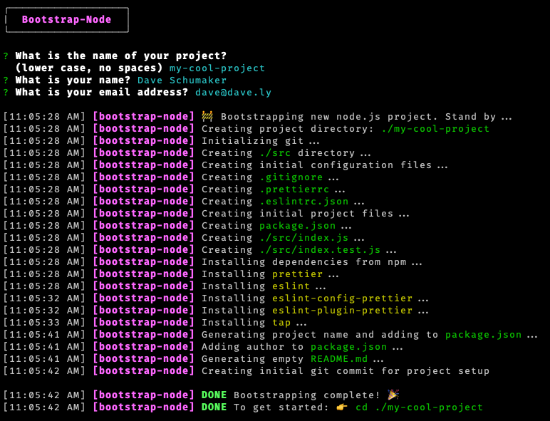

# Bootstrap-Node

**The problem:** Any time I wanted to create a new Node.js project, I found myself having to dig through old projects to copy over a bunch of configuration files, like `.prettierrc` and `.eslintrc` and repeatedly installing the same `eslint` plugins from `npm`. It took a bit of time and effort to get my initial project up and running, since I wanted everything to be *just right*. Surely, there must be an easier way.

There is!

**The solution (for me):** This is a project I created to quickly setup a new dev environment for Node.js projects using configuration settings that I frequently use in my various projects. This script greatly simplifies the process of getting a basic template up and running. This also provided a good reason to experiment with creating command line applications in Node.js.

## To use:

1. Clone this project to your local machine: `git clone git@github.com:daveschumaker/bootstrap-node.git`
2. `> cd ./bootstrap-node`
3. `> npm install`
4. Install as a global command line app: `npm run install:global`
5. Invoke `bootstrap-node` anywhere on your system to get started.

## Future TODOs

* Add more configuration options:
* Choose license type
* Option to use / build with `typescript`
* Option to choose `npm` or `yarn`.