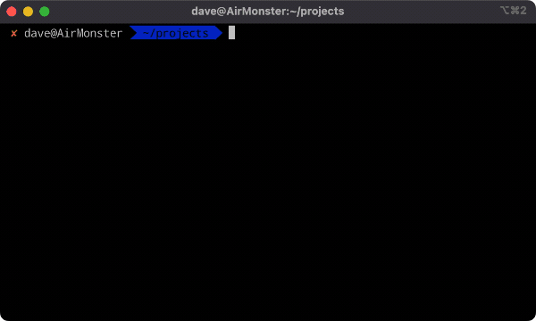

# 🚧 Bootstrap-Node-Project 🚧

**The problem:** Any time I wanted to create a new Node.js project, I found myself having to dig through old projects to copy over a bunch of configuration files, like `.prettierrc` and `.eslintrc` and repeatedly installing the same `eslint` plugins from `npm`. It took a bit of time and effort to get my initial project up and running, since I wanted everything to be *just right*. Surely, there must be an easier way.

There is!

**The solution (for me):** This is a project I created to quickly setup a new dev environment for Node.js projects using configuration settings that I frequently use in my various projects. This script greatly simplifies the process of getting a basic template up and running. This also provided a good reason to experiment with creating command line applications in Node.js.

On my M1 Macbook Air, I can get a new project up and running in **~20 seconds**. 🙌



## To use 🚦

1. Clone this project to your local machine: `git clone git@github.com:daveschumaker/bootstrap-node-project.git`
2. `> cd ./bootstrap-node-project`
3. `> npm install`
4. `> npm run config:setup` to create an empty `config.js` file that can be used to set default name and email address for new projects. Adding defaults to this file is optional.
5. Install as a global command line app: `npm run install:global`
6. Invoke `bootstrap-node` anywhere on your system to get started.

## Details ℹ️

This script installs the following into a new project:

* `eslint` / `prettier` / [various eslint plugins] - handles code formatting and linting in a new project.
* `husky` - Enable precommit hooks for enforcing linting and code styling
* `tap` - Uses Node TAP (Test Anything Protocol) for quick and easy testing and creates a basic test
* `typescript` 🙌 (optional) - Can optionally setup projects with Typescript. (Current default is false)

## Directory structure 🌴

After a new project is bootstrapped, the directory structure looks like this:

```text
my-cool-project/
├─ .husky/
├─ node_modules/
├─ src/
│  ├─ index.js
│  ├─ index.test.js
├─ .eslintrc.json
├─ .gitignore
├─ .prettierrc
├─ package-lock.json
├─ package.json
├─ README.md
```

## Issues 🚨

An ongoing issue that I haven't been able to figure out is that a new project seems to be created with elevated permissions, meaning that you cannot delete the folder as your current user. For example, if you've bootstrapped a new project into the folder `./my-cool-project`, you might see this when trying to remove it.

```text
> rm -rf my-cool-project
rm: my-cool-project: Permission denied
```

The solution seems to be either to elevate yourself to root and run `sudo rm -rf my-cool-project` or to add a dot-slash to indicate the relative path: `rm -rf ./my-cool-project` seems to work as well.

## Future TODOs ✅

* Add more configuration options:
* Choose license type
* Private or public package
* Option to choose `npm` or `yarn`.
* npm `dev` script that uses `nodemon` to watch for changes if installed on system
